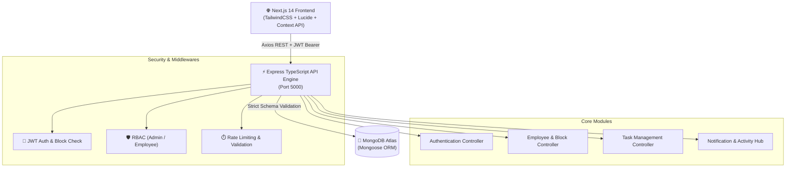

<div align="center">

# 🌐 EmpSphere — Enterprise Workspace Platform

**A Next-Generation, Production-Ready Workforce & Task Management Ecosystem**

[](https://www.typescriptlang.org/)
[](https://nextjs.org/)
[](https://nodejs.org/)
[](https://expressjs.com/)
[](https://www.mongodb.com/)
[](https://tailwindcss.com/)
[](LICENSE)

<p align="center">
  <a href="#-key-features">Key Features</a> •
  <a href="#-system-architecture">Architecture</a> •
  <a href="#-tech-stack">Tech Stack</a> •
  <a href="#-quick-start">Quick Start</a> •
  <a href="#-api-documentation">API Specs</a> •
  <a href="#-security--compliance">Security</a> •
  <a href="#-production-deployment">Deployment</a>
</p>

---

</div>

## 📌 Executive Overview

**EmpSphere** is an enterprise-grade, high-performance employee workspace and HR management platform. Designed for organizations requiring strict role-based access control, task velocity tracking, automated audit streams, and real-time personnel governance, EmpSphere blends modern SaaS aesthetics with robust distributed architecture.

Built with a **Decoupled Architecture** (Next.js 14 App Router on Frontend + Node.js/Express TypeScript Engine on Backend + MongoDB Atlas Distributed Database), EmpSphere delivers sub-second page loads, unified dark/light theming, and enterprise data export capabilities.

---

## ✨ Key Features & Capabilities

### 🔐 1. Enterprise Authentication & Session Security
* **JWT Access & Refresh Token Rotation**: 15-minute ephemeral access tokens paired with secure HTTP-only refresh tokens.
* **Concurrency Mutex Protection**: Thread-safe token refresh mutex to prevent token race conditions during simultaneous API requests.
* **Brute-Force Shield**: Progressive login lockouts (5 failed attempts trigger exponential cooling).
* **Role-Based Routing (RBAC)**: Distinct authorization barriers for `Admin` and `Employee` roles.

### 🛡️ 2. Employee Governance & Access Lockout
* **1-Click Block / Suspend Access**: Admin can instantly suspend rogue or deactivated personnel accounts.
* **Immediate Session Revocation**: Blocking an employee invalidates all their active refresh tokens instantly.
* **Full-Screen Account Lockout**: Blocked personnel are barred from viewing any workspace, task, or team data (`403 Forbidden`).
* **Employee Profile & Task History Modal**: Full visibility into past work, completed tasks, productivity metrics, and assignment archives even when an account is suspended.
* **Dedicated Status Tabs**: Directory organized into `All Members`, `Active Staff`, and `Blocked / Suspended`.

### 📋 3. Task Management & Workflow Velocity
* **Auto-Incrementing Task Codes**: Deterministic, collision-free identifiers (`TSK-1001`, `TSK-1002`, etc.).
* **Multi-Criteria Filter Engine**: Real-time filtering by Status (`Todo`, `In Progress`, `Under Review`, `Completed`), Priority (`Urgent`, `High`, `Medium`, `Low`), Date Ranges, and Search queries.
* **Task Assignment & Auto-Notification**: Assigning tasks or updating task statuses automatically dispatches system notifications to relevant team members and administrators.

### 📊 4. High-Performance Analytics & Reporting
* **Auto-Scaling Recharts Engine**: Dynamic SVG graphs (Monthly Output Area Charts, Workflow Breakdown Donut Charts, Priority Distribution Bar Charts, Weekly Delivery Cadence).
* **Zero Zero-Division Bugs**: Safe KPI calculations that scale seamlessly with 0 records or 100,000+ records.

### 🔔 5. Notification & Live Activity Stream Hub (`/notifications`)
* **3-Tab Activity Stream**: `Unread & New`, `All Activity Logs`, and `Workspace Messages`.
* **Live Employee Action Audit**: Real-time alerts when employees complete tasks, change statuses, or post workspace messages.
* **Interactive Action Controls**: Direct "View Task" link navigation, mark individual notification as read, and bulk "Mark All Read".

### 📤 6. Enterprise Data Export Engine
* **Universal CSV Export**: Generates Excel-compatible CSVs with **UTF-8 Byte Order Mark (`\uFEFF`)** to preserve special characters.
* **Structured JSON Data Backup**: 1-click full task and directory backup.
* **Formatted Print / PDF View**: Clean, printable executive summary table for offline meetings and compliance audits.

### 🎨 7. Design System & Aesthetics
* **Unified Ambient Backdrop**: Soft gradient and deep slate dark mode theme applied consistently across all application routes.
* **Glassmorphism & Micro-Animations**: Smooth cubic bezier transitions, 3D pill toggle switches, and responsive card enclosures.

---

## 🏗️ System Architecture



---

## 💻 Tech Stack

| Layer | Technologies |
| :--- | :--- |
| **Frontend Framework** | [Next.js 14](https://nextjs.org/) (App Router, Server & Client Components) |
| **Language** | [TypeScript 5.x](https://www.typescriptlang.org/) (Strict Mode) |
| **Styling & Design** | [Tailwind CSS](https://tailwindcss.com/), Custom Design Tokens, CSS Variables |
| **Icons & Visuals** | [Lucide React](https://lucide.dev/), Custom SVG BrandMarks |
| **Data Visualization**| [Recharts 2.x](https://recharts.org/) (Responsive SVG Graphs) |
| **Backend Framework** | [Express.js 4.x](https://expressjs.com/) on [Node.js 20+](https://nodejs.org/) |
| **Database & ORM** | [MongoDB Atlas](https://www.mongodb.com/atlas) with [Mongoose 8.x](https://mongoosejs.com/) |
| **Security & Auth** | `jsonwebtoken`, `bcryptjs`, `cors`, `cookie-parser`, `dotenv` |
| **Testing** | Automated Full-Flow E2E Test Suite (`test-suite.ts`) |

---

## 🚀 Quick Start & Installation

### 1. Prerequisites
* **Node.js**: `v18.x` or `v20.x+`
* **npm**: `v9.x+`
* **MongoDB**: Local MongoDB instance or free [MongoDB Atlas Cluster URI](https://www.mongodb.com/cloud/atlas)

---

### 2. Repository Setup

```bash
# Clone the repository
git clone https://github.com/your-org/nexus-auth-system.git
cd nexus-auth-system/empsphere
```

---

### 3. Backend Setup

```bash
# Navigate to backend directory
cd backend

# Install dependencies
npm install

# Configure environment variables
cp .env.example .env
```

**Configure `backend/.env`:**
```env
PORT=5000
NODE_ENV=development
MONGO_URI=mongodb+srv://<username>:<password>@cluster0.mongodb.net/empsphere?retryWrites=true&w=majority
JWT_ACCESS_SECRET=your_super_secret_access_jwt_key_here_32chars
JWT_REFRESH_SECRET=your_super_secret_refresh_jwt_key_here_32chars
JWT_ACCESS_EXPIRES_IN=15m
JWT_REFRESH_EXPIRES_IN=7d
FRONTEND_URL=http://localhost:3000
```

```bash
# Start backend server in development mode
npm run dev
```
> Server will boot on `http://localhost:5000` with connected MongoDB confirmation.

---

### 4. Frontend Setup

```bash
# Open a new terminal tab and navigate to frontend directory
cd empsphere/frontend

# Install dependencies
npm install

# Configure environment variables
cp .env.example .env.local
```

**Configure `frontend/.env.local`:**
```env
NEXT_PUBLIC_API_URL=http://localhost:5000/api
```

```bash
# Start Next.js dev server
npm run dev
```
> Open [http://localhost:3000](http://localhost:3000) in your browser.

---

## 📡 API Specification

### Authentication Endpoints (`/api/auth`)
| Method | Endpoint | Access | Description |
| :--- | :--- | :--- | :--- |
| `POST` | `/api/auth/register` | Public | Register new employee account |
| `POST` | `/api/auth/login` | Public | Authenticate user & receive access token + refresh cookie |
| `POST` | `/api/auth/refresh` | Public | Refresh expired access token via HTTP-only cookie |
| `POST` | `/api/auth/logout` | Authenticated | Revoke refresh token and invalidate active session |

### Employee & Governance Endpoints (`/api/users`)
| Method | Endpoint | Access | Description |
| :--- | :--- | :--- | :--- |
| `GET` | `/api/users/me` | Authenticated | Retrieve current user profile and preferences |
| `PATCH`| `/api/users/me` | Authenticated | Update profile details, avatar, banner, or theme |
| `GET` | `/api/users` | Authenticated | List all active/blocked employee directory members |
| `GET` | `/api/users/analytics` | Authenticated | Get calculated KPIs, velocity charts, and status metrics |
| `GET` | `/api/users/dashboard` | Authenticated | Get dashboard cards and pending work breakdown |
| `GET` | `/api/users/:id/performance` | Admin | Get full task history and completion stats for an employee |
| `PATCH`| `/api/users/:id/block` | Admin | Suspend employee account and terminate all active sessions |
| `PATCH`| `/api/users/:id/unblock` | Admin | Restore employee access and account privileges |

### Task Management Endpoints (`/api/tasks`)
| Method | Endpoint | Access | Description |
| :--- | :--- | :--- | :--- |
| `GET` | `/api/tasks` | Authenticated | Get tasks with status, priority, and date range filters |
| `POST` | `/api/tasks` | Authenticated | Create a new task with unique auto-generated `TSK-XXXX` ID |
| `PATCH`| `/api/tasks/:id` | Authenticated | Update task details or mark as Completed (notifies Admin) |
| `DELETE`| `/api/tasks/:id` | Admin / Creator| Permanently remove task record |

### Notification & Activity Stream Endpoints (`/api/notifications`)
| Method | Endpoint | Access | Description |
| :--- | :--- | :--- | :--- |
| `GET` | `/api/notifications` | Authenticated | Retrieve user notifications & unread count |
| `PATCH`| `/api/notifications/read-all`| Authenticated | Mark all notifications as read |
| `PATCH`| `/api/notifications/:id/read`| Authenticated | Mark single notification as read |
| `DELETE`| `/api/notifications/:id` | Authenticated | Delete a notification item |

---

## 🧪 Testing & Quality Assurance

EmpSphere includes an automated TypeScript end-to-end test suite testing every endpoint:

```bash
# Run backend full-flow test suite
cd backend
npx ts-node src/test-suite.ts
```

**Test Verification Summary:**
```text
==================================================
🚀 STARTING EMP-SPHERE FULL-FLOW SYSTEM TEST SUITE
==================================================

[PASS] 1. Server Health Check: HTTP 200 - EmpSphere API is running.
[PASS] 2. Authenticated as: Anant Singh (admin)
[PASS] 3. Employees Directory: HTTP 200 - Found 12 members
[PASS] 4. Tasks API: HTTP 200 - Retrieved 27 tasks
[PASS] 5. Analytics API: HTTP 200 - Productivity KPI: 26%
[PASS] 6. Notifications API: HTTP 200 - Unread Count: 0
[PASS] 7. Employee Performance API: HTTP 200 - Total Tasks 2, Completed 1
[PASS] 8. Block Employee: HTTP 200 - isBlocked: true
[PASS] 9. Unblock Employee: HTTP 200 - isBlocked restored to: false

==================================================
📊 FINAL RESULT: 9 PASSED / 0 FAILED - 100% OPERATIONAL
==================================================
```

---

## 🔒 Security & Compliance

1. **Digital Personal Data Protection (DPDP) Compliance**:
   * Users can configure data sharing consent and export all personal history on demand.
2. **Access Revocation on Block**:
   * Blocking an employee immediately clears database refresh tokens and throws `403 Forbidden` on subsequent API calls.
3. **Password Hashing**:
   * Passwords hashed using `bcryptjs` with salt rounds = 10.
4. **CORS & HTTP-Only Cookies**:
   * Secure cross-origin resource sharing configured for authorized frontend domains only.

---

## 🚢 Production Deployment

### Production Build

```bash
# Build Frontend
cd frontend
npm run build

# Build Backend
cd ../backend
npm run build
npm start
```

### Docker Containerization (Optional)

```dockerfile
# Production Dockerfile Example for Backend
FROM node:20-alpine AS builder
WORKDIR /app
COPY package*.json tsconfig.json ./
RUN npm ci
COPY src ./src
RUN npm run build

FROM node:20-alpine AS runner
WORKDIR /app
ENV NODE_ENV=production
COPY package*.json ./
RUN npm ci --only=production
COPY --from=builder /app/dist ./dist
EXPOSE 5000
CMD ["node", "dist/server.js"]
```

---

## 📄 License

This project is licensed under the **MIT License** — see the [LICENSE](LICENSE) file for details.

<div align="center">
  <sub>Built with ❤️ for enterprise teams by the EmpSphere Engineering Team.</sub>
</div>
